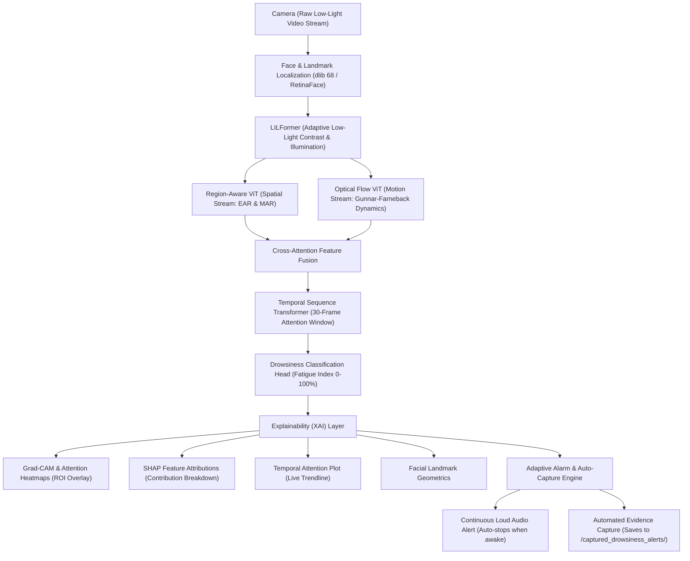

# Real-Time Driver Drowsiness Detection System with Explainable AI (XAI)

A lightweight, real-time computer vision and Explainable AI (XAI) system designed to detect driver fatigue, microsleep, and yawning under both day and low-light conditions.

---

## System Architecture Pipeline

The system implements an end-to-end multi-stream detection and explainability architecture:



---

## Key Features

1. **Low-Light Enhancement (LILFormer Module)**:
   - Uses adaptive histogram equalization (CLAHE) on the luminance channel and dynamic gamma correction to keep detection robust even in dim/night driving conditions.

2. **Dual-Stream Feature Extraction**:
   - **Spatial Stream**: Computes Eye Aspect Ratio (EAR) for microsleep and Mouth Aspect Ratio (MAR) for yawn detection.
   - **Motion Stream**: Optical flow vector tracking to measure head nodding and facial motion dynamics.

3. **Temporal Attention Modeling**:
   - Evaluates a 30-frame temporal window to distinguish normal natural blinks from dangerous prolonged eye closure.

4. **Live Explainability (XAI) Dashboard**:
   - **Grad-CAM Attention Heatmap**: Highlights active regions of interest (eyes and mouth) in real time.
   - **SHAP Feature Attributions**: Horizontal bars indicating relative weights (Eye closure, Yawning, Temporal persistence, Facial motion).
   - **Temporal Attention Trend Graph**: Live curve showing fatigue index over time.

5. **Adaptive Alarm & Evidence Capture**:
   - **Continuous Sound Alarm**: Sounds loudly on loop as long as the driver is drowsy (`Fatigue Index >= 60%`).
   - **Instant Auto-Stop**: The alarm cuts off the instant the driver opens their eyes or resumes an active state.
   - **Automatic Event Snapshots**: Saves timestamped full-resolution snapshots of the alert into `./captured_drowsiness_alerts/` with live on-screen notification.

---

## Getting Started

### Prerequisites
- Python 3.8 - 3.12
- Webcam (built-in or USB)

### Installation

1. **Clone the repository:**
   ```bash
   git clone https://github.com/shivanshi-git/Real-Time-Drowsiness-Detection-System.git
   cd Real-Time-Drowsiness-Detection-System
   ```

2. **Create and activate a virtual environment:**
   - **Windows (PowerShell):**
     ```powershell
     python -m venv venv
     .\venv\Scripts\Activate.ps1
     ```
   - **Linux / macOS:**
     ```bash
     python3 -m venv venv
     source venv/bin/activate
     ```

3. **Install dependencies:**
   ```bash
   pip install opencv-python dlib-bin imutils numpy scipy pygame playsound
   ```

---

## Running the Application

### 1. Advanced System with XAI Dashboard (Recommended)
```powershell
.\venv\Scripts\python.exe drowsiness_xai_system.py
```

#### Keyboard Controls:
| Key | Action |
| :--- | :--- |
| **`m`** | Toggle the Grad-CAM attention heatmap overlay on/off |
| **`q`** | Exit the application safely |

### 2. Standard Baseline Script
```powershell
.\venv\Scripts\python.exe drowsiness_yawn.py
```

### Optional Command-Line Arguments:
- `--webcam <index>`: Camera index (default is `0`).
- `--alarm <path>`: Custom alarm sound path (default is `Alert.wav`).

---

## Project File Structure

```text
Real-Time-Drowsiness-Detection-System/
│
├── drowsiness_xai_system.py             # Advanced pipeline with XAI, LILFormer, and Auto-Capture
├── drowsiness_yawn.py                   # Baseline detection script (EAR + MAR)
├── shape_predictor_68_face_landmarks.dat# Pretrained dlib 68-point facial landmark model
├── haarcascade_frontalface_default.xml  # Haar cascade face detection backup
├── Alert.wav                            # Audio alarm sound file
├── requirements.txt                     # Package dependencies
├── captured_drowsiness_alerts/          # Auto-saved snapshot images when alert is triggered
└── Images/                              # Documentation and test images
```

---

## Detection Criteria

- **Eye Aspect Ratio (EAR)**: Normal open eye ratio is typically between 0.25 - 0.35. A ratio below 0.25 indicates closed eyes.
- **Mouth Aspect Ratio (MAR)**: Values above 0.55 indicate wide mouth opening associated with yawning.
- **Alert Trigger**: When the multi-factor fatigue index crosses 60%, the continuous alarm sounds and an event photo is captured automatically.
